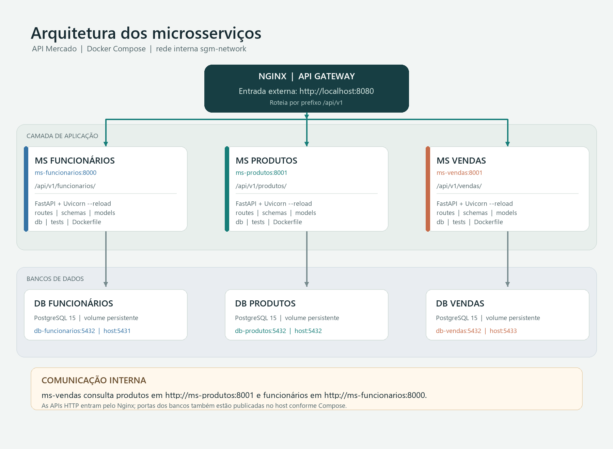

# API de Gerenciamento de Mercado

Projeto de estudo para gerenciamento de operações de um mercado, desenvolvido com Python e FastAPI. A arquitetura atual separa funcionários, produtos e vendas em microsserviços independentes, executados com Docker Compose e acessados externamente por um proxy reverso Nginx.



## Funcionalidades

- Cadastro, consulta, atualização, exclusão e autenticação de funcionários.
- Cadastro e consulta de produtos, incluindo consultas por título e ID.
- Criação e consulta de vendas, atualização e exclusão, além de relatórios por funcionário.
- Validação dos dados de produto e funcionário ao criar uma venda, por chamadas HTTP entre os serviços.
- Persistência separada por domínio: cada microsserviço possui seu próprio banco PostgreSQL.

## Tecnologias

- **Python 3.11** como linguagem da aplicação.
- **FastAPI** para construção das APIs REST.
- **Pydantic** para validação e serialização dos dados.
- **SQLAlchemy** como ORM e **Psycopg2** como driver PostgreSQL.
- **PostgreSQL 15** para persistência dos dados.
- **HTTPX** para comunicação entre microsserviços.
- **Uvicorn** como servidor ASGI.
- **Docker e Docker Compose** para empacotamento e execução local.
- **Nginx** como proxy reverso e ponto de entrada HTTP.
- **Pytest** para testes automatizados.

## Organização do projeto

```text
.
├── docker-compose.yml
├── nginx/
│   └── default.conf
├── imgs/
│   └── arquitetura_atual_microsservicos.png
└── src/
	└── services/
		├── ms-funcionarios/
		│   ├── Dockerfile
		│   ├── requirements.txt
		│   └── app/
		│       ├── db/          # conexão, dependências e consultas
		│       ├── models/      # tabelas SQLAlchemy
		│       ├── routes/      # endpoints HTTP
		│       ├── schemas/     # contratos e validação Pydantic
		│       ├── security/    # autenticação e segurança
		│       └── tests/
		├── ms-produtos/
		│   ├── Dockerfile
		│   ├── requirements.txt
		│   └── app/             # db/, models/, routes/, schemas/ e tests/
		└── ms-vendas/
			├── Dockerfile
			├── requirements.txt
			└── app/             # db/, models/, routes/, schemas/ e tests/
```

Cada serviço tem sua própria aplicação FastAPI, dependências, modelos, schemas, rotas e testes. O `docker-compose.yml` também define um PostgreSQL e um volume persistente por domínio.

## Da aplicação monolítica aos microsserviços

Na organização monolítica, os domínios de funcionários, produtos e vendas pertenciam à mesma aplicação: eram executados juntos e compartilhavam o processo e a configuração da API. A mudança para microsserviços separou essas responsabilidades em aplicações independentes:

1. **Funcionários** mantém cadastro, autenticação e dados de funcionários.
2. **Produtos** mantém o catálogo, preços e consultas de produtos.
3. **Vendas** registra vendas e seus itens, consultando os serviços de produtos e funcionários por HTTP quando precisa validar os dados.

Cada serviço passa a ser iniciado e implantado separadamente e mantém seu próprio banco. Por isso, a venda guarda um retrato dos dados necessários no momento da operação: por exemplo, ID e título do produto, preço unitário, ID e dados do funcionário. As relações entre bancos não são feitas por chaves estrangeiras compartilhadas; a integração ocorre pelas APIs.

O Nginx recebe as chamadas externas e encaminha os caminhos para a API responsável. Internamente, o Compose oferece DNS entre containers pela rede `sgm-network`, então vendas acessa produtos em `http://ms-produtos:8001` e funcionários em `http://ms-funcionarios:8000`. O Nginx é um proxy reverso; políticas avançadas de API Gateway, como autenticação centralizada e rate limiting, ainda não estão configuradas.

## Executar localmente

### Pré-requisitos

- Docker Desktop instalado e em execução.
- Portas `8080`, `5431`, `5432` e `5433` disponíveis no host.

Na raiz do repositório, construa as imagens e inicie os serviços:

```powershell
docker compose up --build -d
```

Verifique os containers e consulte logs:

```powershell
docker compose ps
docker compose logs -f
```

Para parar os containers sem remover os dados persistidos:

```powershell
docker compose down
```

As aplicações montam as pastas locais `app/` e executam Uvicorn com `--reload`; alterações no código Python reiniciam o serviço correspondente. Se mudar um `Dockerfile` ou `requirements.txt`, reconstrua a imagem, por exemplo:

```powershell
docker compose up --build -d ms-vendas
```

Não use `docker compose down -v` a menos que queira apagar os volumes e os dados dos bancos.

## Acesso às APIs

As APIs HTTP são acessadas pelo Nginx em `http://localhost:8080`. O proxy encaminha estes prefixos:

| Serviço | Caminho externo | Destino dentro da rede Docker |
| --- | --- | --- |
| Funcionários | `/api/v1/funcionarios/` | `ms-funcionarios:8000` |
| Produtos | `/api/v1/produtos/` | `ms-produtos:8001` |
| Vendas | `/api/v1/vendas/` | `ms-vendas:8001` |

Exemplos de chamadas:

```text
GET  http://localhost:8080/api/v1/funcionarios/
GET  http://localhost:8080/api/v1/produtos/
POST http://localhost:8080/api/v1/vendas/?titulo_produto=Arroz&id_funcionario=1
```

No endpoint atual de criação de venda, `titulo_produto` e `id_funcionario` são query parameters. A configuração do Nginx encaminha os caminhos `/api/v1/...`; as rotas `/docs` do Swagger não estão publicadas pelo proxy neste momento.

## Portas e persistência

- Nginx: `localhost:8080` encaminha para a porta `80` do container.
- Funcionários: porta `8000` na rede interna; sem publicação direta da API no host.
- Produtos: porta `8001` na rede interna; sem publicação direta da API no host.
- Vendas: porta `8001` na rede interna; sem publicação direta da API no host.
- PostgreSQL: porta interna `5432` em cada container; portas do host `5431` (funcionários), `5432` (produtos) e `5433` (vendas).

Os dados são mantidos nos volumes `db_funcionarios_data`, `db_produtos_data` e `db_vendas_data`. As credenciais definidas no Compose são valores de desenvolvimento; não devem ser reutilizadas em produção.

## Testes

Os testes ficam em `app/tests/` dentro de cada microsserviço. Eles podem substituir dependências de banco e chamadas entre serviços por mocks para testar cada API isoladamente. Consulte os arquivos de teste de cada serviço para os cenários disponíveis.
