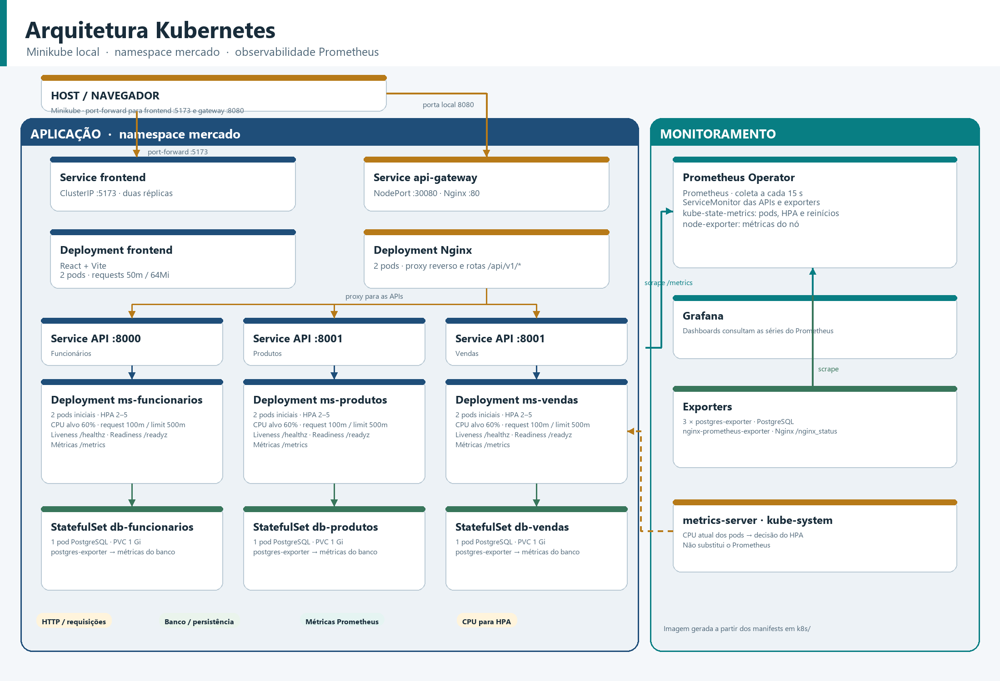

# API de Gerenciamento de Mercado

Projeto de estudo para gerenciamento de operações de um mercado, desenvolvido com Python e FastAPI. A arquitetura atual separa funcionários, produtos e vendas em microsserviços independentes, executados com Docker Compose e acessados externamente por um proxy reverso Nginx. As imagens a seguir foram geradas por IA apartir do código e da configuração do projeto.


## Arquitetura Kubernetes



O diagrama mostra os workloads no Minikube: o namespace `mercado` contém frontend, Nginx/API Gateway, três APIs com HPA e três bancos PostgreSQL StatefulSet; o namespace `monitoring` reúne Prometheus, Grafana e exporters. O metrics-server fornece métricas de CPU para decisão dos HPAs. A imagem é gerada a partir dos manifests em `k8s/` pelo script `k8s/generate_architecture_diagram.py`.

## Funcionalidades

- Cadastro, consulta, atualização, exclusão e autenticação de funcionários.
- Cadastro e consulta de produtos, incluindo consultas por título e ID.
- Criação e consulta de vendas, atualização e exclusão, além de relatórios por funcionário.
- Validação dos dados de produto e funcionário ao criar uma venda, por chamadas HTTP entre os serviços.
- Persistência separada por domínio: cada microsserviço possui seu próprio banco PostgreSQL.

## Tecnologias

- **Python 3.11** como linguagem da aplicação.
- **FastAPI** para construção das APIs REST.
- **Pydantic** para validação e serialização dos dados.
- **SQLAlchemy** como ORM e **Psycopg2** como driver PostgreSQL.
- **PostgreSQL 15** para persistência dos dados.
- **HTTPX** para comunicação entre microsserviços.
- **Uvicorn** como servidor ASGI.
- **Docker e Docker Compose** para empacotamento e execução local.
- **Nginx** como proxy reverso e ponto de entrada HTTP.
- **Pytest** para testes automatizados.
- **React, TypeScript e Vite** para a interface web.
- **Tailwind CSS** para estilização responsiva do frontend.

## Organização do projeto

```text
.
├── docker-compose.yml
├── frontend/
│   ├── package.json
│   └── src/
│       ├── App.tsx
│       ├── Header/       # menu lateral e submenus
│       ├── Home/         # composição das telas
│       ├── Login/        # autenticação
│       ├── Fornecedor/   # cadastro, listagem, edição e exclusão
│       ├── Produtos/     # cadastro, listagem, edição e exclusão
│       └── Vendas/       # cadastro, listagem, edição e exclusão
├── nginx/
│   └── default.conf
├── imgs/
│   └── arquitetura_atual_microsservicos.png
└── src/
	└── services/
		├── ms-funcionarios/
		│   ├── Dockerfile
		│   ├── requirements.txt
		│   └── app/
		│       ├── db/          # conexão, dependências e consultas
		│       ├── models/      # tabelas SQLAlchemy
		│       ├── routes/      # endpoints HTTP
		│       ├── schemas/     # contratos e validação Pydantic
		│       ├── security/    # autenticação e segurança
		│       └── tests/
		├── ms-produtos/
		│   ├── Dockerfile
		│   ├── requirements.txt
		│   └── app/             # db/, models/, routes/, schemas/ e tests/
		└── ms-vendas/
			├── Dockerfile
			├── requirements.txt
			└── app/             # db/, models/, routes/, schemas/ e tests/
```

Cada serviço tem sua própria aplicação FastAPI, dependências, modelos, schemas, rotas e testes. O `docker-compose.yml` também define um PostgreSQL e um volume persistente por domínio.

## Frontend

O frontend é uma aplicação React com TypeScript e Vite. Após o login, o usuário acessa um menu lateral responsivo com submenus para cada domínio da API:

- **Funcionários**
	- Cadastrar funcionário.
	- Listar funcionários.
	- Editar funcionário.
	- Excluir funcionário.
- **Produtos**
	- Cadastrar produto.
	- Listar produtos.
	- Editar produto.
	- Excluir produto.
- **Vendas**
	- Cadastrar venda.
	- Selecionar o funcionário vendedor a partir da lista cadastrada.
	- Listar vendas.
	- Editar venda e quantidade dos itens.
	- Excluir venda.

As telas exibem estados de carregamento, mensagens de sucesso e erros retornados pelas APIs. As tabelas possuem ações de edição e exclusão, com confirmação antes da remoção dos registros.

### Executar o frontend isoladamente

Para executar apenas o frontend em modo de desenvolvimento:

```powershell
cd frontend
npm install
npm run dev
```

O frontend ficará disponível em `http://localhost:5173`. Para que as operações funcionem, os serviços Docker e o Nginx também devem estar em execução:

```powershell
cd ..
docker compose up --build -d
```

### Componentes principais

```text
frontend/src/
├── App.tsx
├── Header/
│   └── Header.tsx
├── Login/
│   └── Login.tsx
├── Fornecedor/
│   ├── FuncionarioForm.tsx
│   ├── FuncionarioList.tsx
│   └── FuncionarioEditForm.tsx
├── Produtos/
│   ├── ProdutoForm.tsx
│   ├── ProdutoList.tsx
│   └── ProdutoEditForm.tsx
└── Vendas/
		├── VendaForm.tsx
		├── VendaList.tsx
		└── VendaEditForm.tsx
```

## Da aplicação monolítica aos microsserviços

Na organização monolítica, os domínios de funcionários, produtos e vendas pertenciam à mesma aplicação: eram executados juntos e compartilhavam o processo e a configuração da API. A mudança para microsserviços separou essas responsabilidades em aplicações independentes:

1. **Funcionários** mantém cadastro, autenticação e dados de funcionários.
2. **Produtos** mantém o catálogo, preços e consultas de produtos.
3. **Vendas** registra vendas e seus itens, consultando os serviços de produtos e funcionários por HTTP quando precisa validar os dados.

Cada serviço passa a ser iniciado e implantado separadamente e mantém seu próprio banco. Por isso, a venda guarda um retrato dos dados necessários no momento da operação: por exemplo, ID e título do produto, preço unitário, ID e dados do funcionário. As relações entre bancos não são feitas por chaves estrangeiras compartilhadas; a integração ocorre pelas APIs.

O Nginx recebe as chamadas externas e encaminha os caminhos para a API responsável. Internamente, o Compose oferece DNS entre containers pela rede `sgm-network`, então vendas acessa produtos em `http://ms-produtos:8001` e funcionários em `http://ms-funcionarios:8000`. O Nginx é um proxy reverso; políticas avançadas de API Gateway, como autenticação centralizada e rate limiting, ainda não estão configuradas.

## Executar localmente

### Pré-requisitos

- Docker Desktop instalado e em execução.
- Portas `8080`, `5431`, `5432` e `5433` disponíveis no host.

Na raiz do repositório, construa as imagens e inicie os serviços:

```powershell
docker compose up --build -d
```

Verifique os containers e consulte logs:

```powershell
docker compose ps
docker compose logs -f
```

Para parar os containers sem remover os dados persistidos:

```powershell
docker compose down
```

As aplicações montam as pastas locais `app/` e executam Uvicorn com `--reload`; alterações no código Python reiniciam o serviço correspondente. Se mudar um `Dockerfile` ou `requirements.txt`, reconstrua a imagem, por exemplo:

```powershell
docker compose up --build -d ms-vendas
```

Não use `docker compose down -v` a menos que queira apagar os volumes e os dados dos bancos.

## Acesso às APIs

As APIs HTTP são acessadas pelo Nginx em `http://localhost:8080`. O proxy encaminha estes prefixos:

| Serviço | Caminho externo | Destino dentro da rede Docker |
| --- | --- | --- |
| Funcionários | `/api/v1/funcionarios/` | `ms-funcionarios:8000` |
| Produtos | `/api/v1/produtos/` | `ms-produtos:8001` |
| Vendas | `/api/v1/vendas/` | `ms-vendas:8001` |

Exemplos de chamadas:

```text
GET  http://localhost:8080/api/v1/funcionarios/
GET  http://localhost:8080/api/v1/produtos/
POST http://localhost:8080/api/v1/vendas/?titulo_produto=Arroz&id_funcionario=1
```

No endpoint atual de criação de venda, `titulo_produto` e `id_funcionario` são query parameters. A configuração do Nginx encaminha os caminhos `/api/v1/...`; as rotas `/docs` do Swagger não estão publicadas pelo proxy neste momento.

## Portas e persistência

- Nginx: `localhost:8080` encaminha para a porta `80` do container.
- Funcionários: porta `8000` na rede interna; sem publicação direta da API no host.
- Produtos: porta `8001` na rede interna; sem publicação direta da API no host.
- Vendas: porta `8001` na rede interna; sem publicação direta da API no host.
- PostgreSQL: porta interna `5432` em cada container; portas do host `5431` (funcionários), `5432` (produtos) e `5433` (vendas).

Os dados são mantidos nos volumes `db_funcionarios_data`, `db_produtos_data` e `db_vendas_data`. As credenciais definidas no Compose são valores de desenvolvimento; não devem ser reutilizadas em produção.

## Testes

Os testes ficam em `app/tests/` dentro de cada microsserviço. Eles podem substituir dependências de banco e chamadas entre serviços por mocks para testar cada API isoladamente. Consulte os arquivos de teste de cada serviço para os cenários disponíveis.

# Executar no Minikube e Kubernetes
A baixo estão os comandos para criar um cluster Minikube local e executar a aplicação. Eles constroem as imagens, carregam-nas no cluster, criam os recursos e permitem inspecionar o estado dos pods e deployments.

Com o Docker Desktop aberto usando o mecanismo Linux. Inicie o cluster Minikube e habilite o metrics-server, necessario para o HPA obter metricas de CPU:

```powershell
minikube start --driver=docker --cpus=4 --memory=6144
minikube addons enable metrics-server
kubectl config use-context minikube
kubectl get nodes
```

Confirme o contexto antes de aplicar os manifests:

```powershell
kubectl config current-context
```

O resultado esperado e `minikube`. Os comandos abaixo criam recursos nesse contexto.


## Construir e carregar as imagens

Construa as imagens locais a partir da raiz do repositorio:

```powershell
docker build -t api-mercado/ms-funcionarios:atividade4 ./src/services/ms-funcionarios
docker build -t api-mercado/ms-produtos:atividade4 ./src/services/ms-produtos
docker build -t api-mercado/ms-vendas:atividade4 ./src/services/ms-vendas
docker build -t api-mercado/frontend:atividade4 ./frontend
```

Carregue-as no cluster Minikube para que os pods consigam encontra-las:

```powershell
minikube image load api-mercado/ms-funcionarios:atividade4
minikube image load api-mercado/ms-produtos:atividade4
minikube image load api-mercado/ms-vendas:atividade4
minikube image load api-mercado/frontend:atividade4
```

## 4. Criar os recursos da aplicacao

Primeiro crie os bancos de dados. As APIs dependem deles para inicializar:

```powershell
kubectl apply -f ./k8s/01-databases.yaml
kubectl rollout status statefulset/db-funcionarios -n mercado --timeout=180s
kubectl rollout status statefulset/db-produtos -n mercado --timeout=180s
kubectl rollout status statefulset/db-vendas -n mercado --timeout=180s
```

Em seguida crie as APIs, o frontend, o Nginx, os HPAs e os `ServiceMonitor`; por ultimo, os exporters dos bancos:

```powershell
kubectl apply -f ./k8s/02-applications.yaml
kubectl apply -f ./k8s/03-postgres-exporters.yaml
```

Espere os componentes principais ficarem prontos:

```powershell
kubectl rollout status deployment/ms-funcionarios -n mercado --timeout=180s
kubectl rollout status deployment/ms-produtos -n mercado --timeout=180s
kubectl rollout status deployment/ms-vendas -n mercado --timeout=180s
kubectl rollout status deployment/frontend -n mercado --timeout=180s
kubectl rollout status deployment/nginx -n mercado --timeout=180s
```

As APIs iniciam com duas replicas. Seus HPAs podem aumentar ate cinco, com alvo de CPU de 60%. Os bancos e exporters permanecem com uma replica.
# Configuração para Minikube e Kubernetes

A seguir estão os comandos para executar a aplicação em um cluster Minikube local. Eles constroem as imagens, carregam-nas no cluster, criam os recursos e permitem inspecionar o estado dos pods e deployments.

## Como os manifests criam os pods

Os arquivos YAML declaram o estado desejado dos recursos. Ao aplicar um manifesto, o Kubernetes cria ou atualiza os controladores; são esses controladores que mantêm os pods disponíveis. A estrutura mais importante de um manifesto costuma ser:

| Campo | Função |
| --- | --- |
| `apiVersion` | Versão da API Kubernetes usada pelo recurso. |
| `kind` | Tipo do recurso, como `Deployment`, `StatefulSet`, `Service` ou `HorizontalPodAutoscaler`. |
| `metadata` | Nome, namespace e labels do recurso. |
| `spec` | Estado desejado: réplicas, seletores, template de pod, containers, imagens, recursos e probes. |

O pod fica definido no `spec.template` de um `Deployment` ou `StatefulSet`. O template contém labels e a especificação dos containers. Os labels precisam corresponder ao `spec.selector` do controlador para que ele reconheça e gerencie os pods.

### Responsabilidade de cada arquivo

| Arquivo | Recursos que controlam a criação | Pods esperados |
| --- | --- | --- |
| `k8s/01-databases.yaml` | Cria o namespace `mercado`, o Secret e três `StatefulSet`. Cada StatefulSet declara `replicas: 1`, template do PostgreSQL e um PVC de 1 Gi. | `db-funcionarios-0`, `db-produtos-0` e `db-vendas-0`. A identidade ordinal e o volume persistente são mantidos pelo StatefulSet. |
| `k8s/02-applications.yaml` | Declara `Deployment` para as três APIs, frontend, Nginx e Nginx exporter. Também declara Services, ConfigMap, ServiceMonitors, gateway e HPAs. | Cada Deployment mantém sua quantidade desejada: APIs, frontend e Nginx começam com duas réplicas; exporter começa com uma. |
| `k8s/03-postgres-exporters.yaml` | Declara um `Deployment` para cada PostgreSQL exporter, com Service e ServiceMonitor correspondentes. | Um pod exporter para cada banco: funcionários, produtos e vendas. |

O fluxo de criação das APIs é:

```text
Deployment -> ReplicaSet -> Pods
```

O Deployment guarda o template e o número desejado de réplicas. Seu ReplicaSet compara esse número com os pods existentes e cria ou remove pods para reconciliar a diferença. Por isso, ao deletar manualmente um pod gerenciado, o ReplicaSet cria outro. Para os bancos, o StatefulSet realiza a mesma manutenção de réplicas, mas dá nomes previsíveis aos pods e associa volumes persistentes.

### O que não cria pods diretamente

- `Service` seleciona pods por labels e encaminha tráfego para eles; não cria pods.
- `HorizontalPodAutoscaler` observa métricas de CPU e altera o número desejado de réplicas do Deployment. O ReplicaSet então cria ou remove pods. O HPA depende do metrics-server para obter CPU.
- `ServiceMonitor` informa ao Prometheus quais endpoints coletar; não cria pods. A stack Prometheus é instalada separadamente com Helm no namespace `monitoring`.
- `ConfigMap` guarda a configuração do Nginx; sozinho, não cria pods. O Deployment Nginx monta essa configuração no container.

Assim, as APIs iniciam com duas réplicas e podem variar entre duas e cinco pelo HPA, cujo alvo de CPU é 60%. Os limites e requests de CPU/memória, probes de liveness e readiness são definidos nos templates de pod dos Deployments.

## Consultar pods e Deployments

Liste pods, incluindo o no onde cada um esta executando:

```powershell
kubectl get pods -n mercado -o wide
kubectl get deployments -n mercado
kubectl get statefulsets -n mercado
kubectl get services -n mercado
kubectl get hpa -n mercado
kubectl top pods -n mercado
```

Acompanhe as mudancas em tempo real:

```powershell
kubectl get pods -n mercado -w
```

Para inspecionar um pod especifico, primeiro obtenha seu nome com `kubectl get pods -n mercado`. Depois:

```powershell
kubectl describe pod NOME_DO_POD -n mercado
kubectl logs NOME_DO_POD -n mercado
```

Use `kubectl logs -f NOME_DO_POD -n mercado` para acompanhar os logs continuamente. Se um pod tiver mais de um container, indique o container com `-c NOME_DO_CONTAINER`.

## Criar um pod de teste manualmente

Os pods da aplicacao sao criados pelos Deployments quando os manifests sao aplicados. Para aprender a criar um pod avulso de teste, use:

```powershell
kubectl run pod-teste --image=nginx:alpine --restart=Never --port=80 -n mercado
kubectl get pod pod-teste -n mercado -o wide
kubectl describe pod pod-teste -n mercado
kubectl logs pod-teste -n mercado
```

Esse pod de teste nao faz parte da aplicacao e nao e recriado por um Deployment. Remova-o ao terminar:

```powershell
kubectl delete pod pod-teste -n mercado
```

Para verificar a criacao gerenciada da aplicacao, veja os pods que aparecem depois de `kubectl apply -f ./k8s/02-applications.yaml`:

```powershell
kubectl get pods -n mercado -l app=ms-produtos -w
```

## Deletar um pod e observar a recuperacao

Use uma API gerenciada pelo Deployment, por exemplo `ms-produtos`. Em um terminal, escolha e remova um dos pods:

```powershell
$pod = kubectl get pods -n mercado -l app=ms-produtos -o jsonpath='{.items[0].metadata.name}'
$pod
kubectl delete pod $pod -n mercado
```

Em outro terminal, observe a substituicao:

```powershell
kubectl get pods -n mercado -l app=ms-produtos -w
```